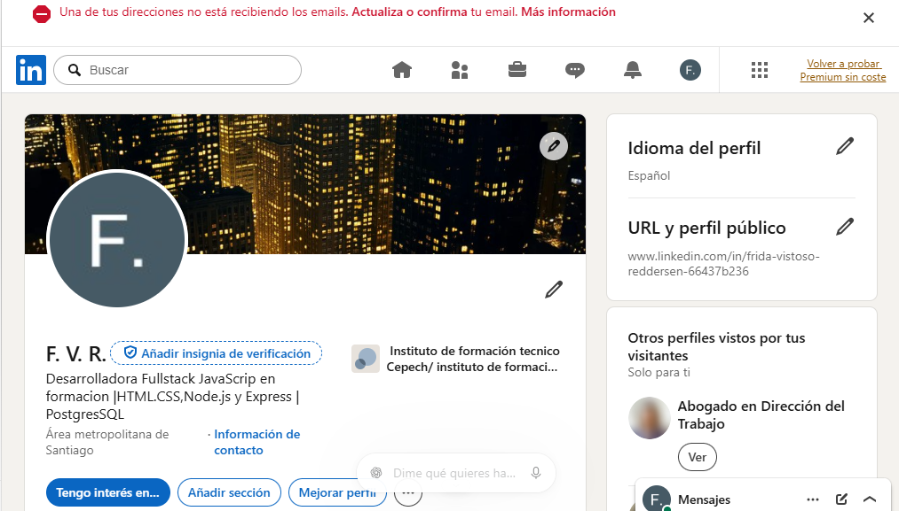
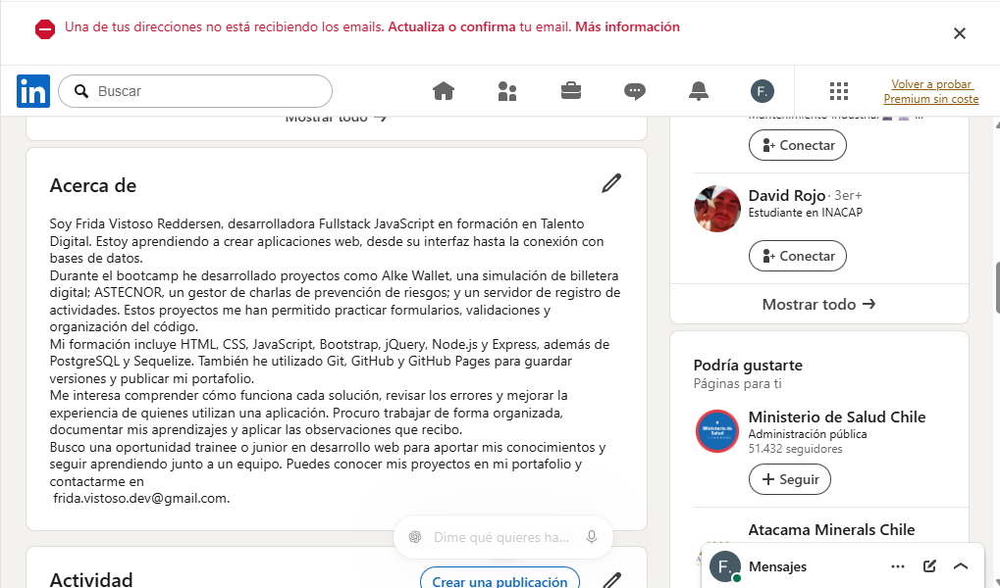

# Desarrollo de Empleabilidad en la Industria Digital

Frida Rosa Vistoso Reddersen

## Titular profesional

Desarrolladora Fullstack JavaScript en formación | HTML, CSS, Node.js y Express | Proyectos web y PostgreSQL

## Acerca de

Soy Frida Vistoso Reddersen, desarrolladora Fullstack JavaScript en formación en Talento Digital. Estoy aprendiendo a crear aplicaciones web, desde su interfaz hasta la conexión con bases de datos.

Durante el bootcamp he desarrollado proyectos como Alke Wallet, una simulación de billetera digital; ASTECNOR, un gestor de charlas de prevención de riesgos; y un servidor de registro de actividades. Estos proyectos me han permitido practicar formularios, validaciones y organización del código.

Mi formación incluye HTML, CSS, JavaScript, Bootstrap, jQuery, Node.js y Express, además de PostgreSQL y Sequelize. También he utilizado Git, GitHub y GitHub Pages para guardar versiones y publicar mi portafolio.

Me interesa comprender cómo funciona cada solución, revisar los errores y mejorar la experiencia de quienes utilizan una aplicación. Procuro trabajar de forma organizada, documentar mis aprendizajes y aplicar las observaciones que recibo.

Busco una oportunidad trainee o junior en desarrollo web para aportar mis conocimientos y seguir aprendiendo junto a un equipo. Puedes conocer mis proyectos en mi portafolio y contactarme en frida.vistoso.dev@gmail.com.

## Experiencia formativa y proyectos

### Formación Fullstack JavaScript — Talento Digital, 2026

Desarrollo de proyectos educativos de interfaces web y servicios backend. Práctica de formularios, eventos, persistencia, rutas HTTP y organización del código.

### Alke Wallet — Trinky Wallet

Simulación de billetera digital con consulta de saldo, depósitos, contactos e historial. Trabajo con HTML, CSS, JavaScript, jQuery y Bootstrap. Validación de montos y fondos disponibles. Los datos se conservan en el navegador; no procesa dinero real.

### ASTECNOR

Gestor educativo de charlas de prevención de riesgos. La versión frontend permite registrar y consultar charlas con persistencia local. La evolución backend incorpora Express, Sequelize y PostgreSQL, con cuentas de usuario y registros relacionados. Ambas versiones tienen alcances diferentes.

### Servidor de registro de actividades

Servidor con Node.js y Express que entrega HTML y JSON y registra accesos en archivos. Práctica de rutas, controladores, servicios y manejo de errores.

## Elevator pitch - guion de presentación

Hola, soy Frida Vistoso Reddersen, desarrolladora Fullstack JavaScript en formación en Talento Digital. He trabajado en proyectos como Alke Wallet y ASTECNOR, donde practiqué interfaces, validación de datos y persistencia. Mi base incluye JavaScript, Node.js y Express, y estoy profundizando en PostgreSQL. Me interesa que una aplicación sea clara para quien la usa y que responda bien cuando ocurre un error. Busco una oportunidad junior para aportar mi atención al detalle, aprender de un equipo y asumir desafíos de forma gradual. Quiero aportar esa forma de trabajar a su equipo. Puedo mostrar mis proyectos y explicar sus decisiones y aprendizajes.

## Propuesta de publicación profesional

### Guardar un dato es solo una parte del trabajo

Al desarrollar ASTECNOR durante mi formación, uno de los retos fue pensar qué debía ocurrir cuando un formulario recibía información incorrecta o no lograba guardar un registro.

Trabajar en esos casos me ayudó a prestar más atención a la validación, los mensajes de error y la conservación de los datos. También entendí mejor por qué conviene separar las funciones del código: resulta más sencillo identificar qué parte necesita una corrección.

Sigo fortaleciendo mi base en JavaScript y desarrollo backend. Me llevo una idea de este proceso: una aplicación debe ayudar a la persona tanto cuando todo funciona como cuando algo falla.

¿Qué caso de error les enseñó algo importante en sus primeros proyectos?

#JavaScript #DesarrolloWeb #TalentoDigital #AprendizajeContinuo #PrimerEmpleoIT

## Presencia profesional

Portafolio: https://vreddersenf101-creator.github.io/Portafolio-Frida-Vistoso-Reddersen/

LinkedIn: https://www.linkedin.com/in/frida-vistoso-reddersen-66437b236

## Evidencias de LinkedIn

Actualicé el titular para mostrar mi formación tecnológica y personalicé la dirección del perfil.

Actualicé el Acerca de en cinco párrafos para explicar mi formación, proyectos, herramientas y objetivos laborales.

